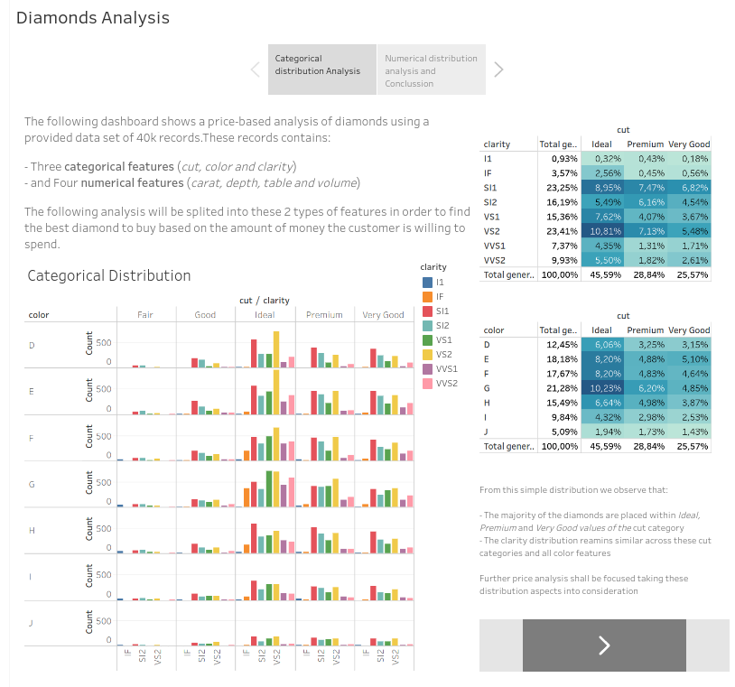

# IH Data Analytics 0420 Project M1

In this project we are challenged to build a data pipeline using multiple techonologies to extract information of a basic-income poll made in Europe. My end product is presented as a dashboard built in Python Dash as looks below.

---

### :baby: **Status**
v 0.2. API data extraction refactored into local csv.

### :running: **One-liner**
This data pipeline builds a dashboard showing a table of information with filter components and automates the export of a csv of the selected data. The information is extracted from Swagger API dataatwork and a provided database.

### :computer: **Technology stack**
Python, argparse, Pandas, SQLalchemy, Dash, Requests, BeatufulSoup, Plotly.

### :wrench: **Configuration**
Just provide a -r route to where you want the selected data file be stored.

### :see_no_evil: **Usage**
Use the provided filter components to visualize descriptive information of the poll dataset.

### :love_letter: **Contact info**
davidblancoferrandez@gmail.com
